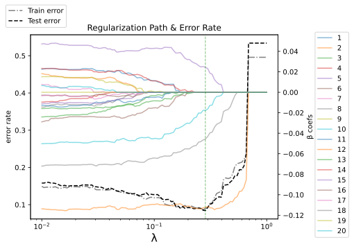
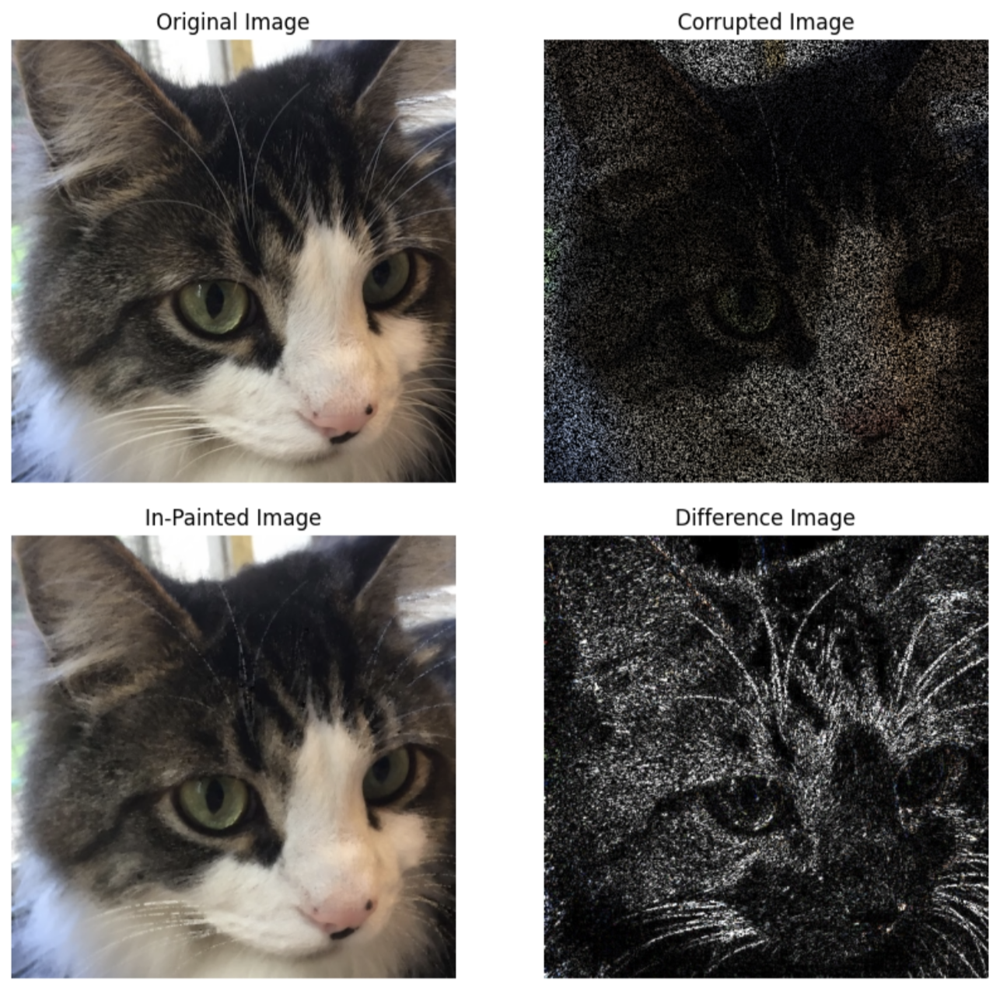

# Convex Optimization

[CVXPY tutorial](https://cvxgrp.org/cvx_short_course)

CVXPY is an open source Python-embedded modeling language for convex
optimization problems. It lets you express your problem in a natural way that
follows the math, rather than in the restrictive standard form required by
solvers. This tutorial will cover the basics of convex optimization, and how to
use CVXPY to specify and solve convex optimization problems, with an emphasis on real-world applications. No prior knowledge of convex optimization is assumed.

## Set up

1. Clone from CVXPY
2. Install CVXPY following [these instructions](https://www.cvxpy.org/install/index.html).
   We recommend Python 3.10 and CVXPY 1.3.
3. Test your CVXPY installation by running ``test.py`` in the repository.

## Slides

for the lecture, see ``book/docs/scipy22_slides``

## Projects

See ``docs/``

**Intro to Python**

See ``docs/python_intro``

- Basics
- CVXPY MSE
  - constraint.dual_value
  - $λ^* = \frac{dM^*}{d c}$, c is the const in the constraint requirements.
- Data Structures
- Python namespaces
- Plotting

**SVM Classifier**

See ``docs/intro``

- average hinge loss + $\ell_1$-regularization

$$
f(\beta,v) = (1/m) \sum_i \left(1 - y_i ( \beta^T x_i-v) \right)_+ + \lambda

\| \beta\|_1
$$

- Regularization Path

**Control in linear dynamical system**

**Image Inpainting**

- Reduce the overall total variance 

$$\mathop{\bf tv}(U) =
\sum_{i=1}^{m-1} \sum_{j=1}^{n-1}
\left\| \left[ \begin{array}{c}
 U_{i+1,j}-U_{ij}\\ U_{i,j+1}-U_{ij} \end{array} \right] \right\|_2.$$

